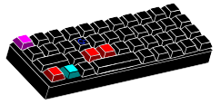

## 𝙁𝙤𝙘𝙪𝙨: 𝘿𝙚𝙫𝙚𝙡𝙤𝙥𝙢𝙚𝙣𝙩 𝙖𝙣𝙙 𝙍𝙚𝙨𝙚𝙖𝙧𝙘𝙝

  

<svg xmlns="http://www.w3.org/2000/svg" width="100%" height="100%">
  
  <image class="normal-image" xlink:href="https://raw.githubusercontent.com/nlklt/nlklt/main/assets/cpp1.svg" width="100%" height="100%"/>
  <image class="hover-image" xlink:href="https://raw.githubusercontent.com/nlklt/nlklt/main/assets/cpp2.svg" width="100%" height="100%"/>
</svg>

## 📊 GitHub Статистика

  
  
  

## Для связи

  

